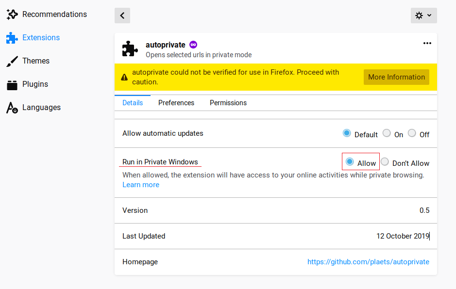

# autoprivate

firefox addon that automatically opens selected websites in a private window

## installation

### developer version

* clone this repo
* install [web-ext](https://extensionworkshop.com/documentation/develop/getting-started-with-web-ext/)
* run `web-ext build` 
* import the built zip file to firefox (about:addons/ctrl+shift+a -> extensions -> gear icon -> install add-on from file)
* allow the extension to run in private windows (about:addons -> three dots above autoprivate -> preferences -> details -> run in private windows)

### firefox addon store

TODO
